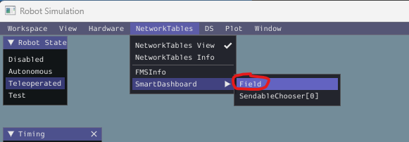
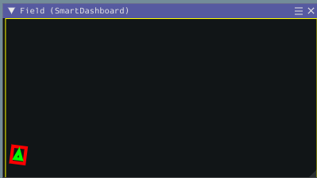

## Odometry
"Odometry" is the mechanism by which the robot can use various sensors to track it's position on the field.  The "pose" is the robot's position (x and y) and orientation (theta) at a particular time.

The simplest way for the robot to keep track of odometry is measure the *change* in the wheel encoder values and gyro position *relative* to a known starting pose.  Periodically, the robot would update the odometry with the latest encoder and gyro values so that the calculated pose is always up to date. Each type of drivetrain generally requires a different way to track position using the HW sensors.  E.g. Here, we use [Differential Drive Odometry](https://docs.wpilib.org/en/stable/docs/software/kinematics-and-odometry/differential-drive-odometry.html) to track the position of the Romi because it physically has the equivalent of a differential drive.  Other drivetrains such as [Swerve](https://docs.wpilib.org/en/stable/docs/software/kinematics-and-odometry/swerve-drive-odometry.html) and [Mecanum](https://docs.wpilib.org/en/stable/docs/software/kinematics-and-odometry/mecanum-drive-odometry.html) each have their own odometry classes with the appropriate math to convert wheel encoder and gyro readings to a position.

After this change, you can visualize the robot's pose in the simulation window:
* In Simulation, enable the "Field" display in Simulation via the following menu option:

    

* A triangle represents the robot's pose and should match the robot's movements

    

*Note: Over time, however, due to sensor sensitivity, drift, wheel slippage, etc, the accumulated error can cause the odmetry's ***calculated*** pose to diverge from the robot's ***actual*** pose.*  You will need to test the odometry's accuracy on your actual robot to understand how reliable the value are and write code accordingly.  Other sensors (e.g. computer vision) may be able to periodically update the odometry's *actual* pose by analyzing and identifying field specific elements such as stationary field elements, retro-reflective tape, AprilTags, etc.

### Summary of [changes](https://github.com/BHSRobotix/RomiTutorial2023/commit/976c74aa6ee90112a2ed7f2a1920fa7e9e38be5f?diff=split):
1. `Drivetrain.java`
    1. Create `DifferentialDriveOdometry`object
    1. Create `Field2d` object
        1. Add field object to SmartDashboard for visualization
    1. ***Periodically***
        1. Update the odometry object with the current position/rotation. This returns the new estimated current robot `Pose2d`
        1. Log the current pose
        1. Update `field` object with the current `pose`
    1. Add accessors `getLeftPositionMeters()` and `getRightPositionMeters()` for current position (converts from radians to meters)
    1. Add accessor `getRotation()` for current rotation (converts from radians to degrees)
