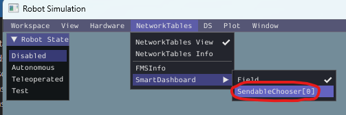
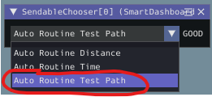

## Path Planning
After measuring the physical characterics (SysId) of the robot, implemented the proper control systems (feedforward and PID control), have a way to track position (odometry), and a way to translate universal values to meaningful wheel speeds directly applicable to the robot (kinematics), we have the infrastructure in place to implement *[path planning](https://docs.wpilib.org/en/stable/docs/software/pathplanning/index.html)*. Path Planning is the process of creating and following trajectories.

In this example, we use the 3rd party [PathPlanner](https://github.com/mjansen4857/pathplanner) library (running on the robot) and the accompanying GUI (running on a PC).  The PathPlanner GUI is used to create trajectories and the library provides functions for the robot to execute them.

After this change, you can run the Test Path Autonomous routine in the simulation window:
* In Simulation, enable the "Field" display in Simulation via the following menu option:

    

* You can select "Auto Routine Test Path" and then click "Autonomous" to run the trajectory following routine

    

### Summary of [changes](https://github.com/BHSRobotix/RomiTutorial2023/commit/af3ce4f8f9969b21b6c1801cd7d67561b52ee606?diff=split):
1. .pathplanner/settings.json
    1. configure the physical characteristics of the Romi and other settings
1. `Test Path.path`
    1. Create sample test path. This path moves counter-clockwise in an ellipse and stops back where it started.

        
1. `RobotContainer.java`
    1. Add new "Auto Routine Test Path" routine to autonomous chooser that uses `Test Path.path` and `followTrajectoryCommand()`
1. `DriveTrain.java`
    1. Create a *combined* feedforward control using `combinedKs`, `combinedKv`, and `combinedKa` SysId constants
    2. Create the`resetOdometry()` method that resets the odometry to the specificed pose
    3. Create the `followTrajectoryCommand()` modeled after the PathPlanner [PPRamseteCommand example](https://github.com/mjansen4857/pathplanner/wiki/PathPlannerLib:-Java-Usage#ppramsetecommand)
1. `vendordeps/PathplannerLib.json`
    * [Install PathPlannerLib](https://github.com/mjansen4857/pathplanner/wiki/PathPlannerLib:-Installing)
