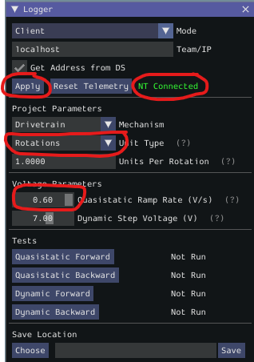
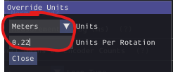
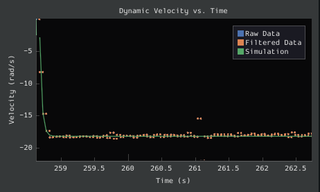

## System Identification (SysId)
*Note: Running SysId is **optional** and it's possible someone else's Romi SysId values will be "good enough"*

All robots are not created equal.  Tolerances, Motor Response, Battery Voltages, etc can all vary such that the *same exact code* running on two seemingly "identical" robots may *behave differently*. Even two "identical" motors on the same robot may behave differently.  E.g. if you apply the same voltage to the left and right Romi motors, you'd expect the robot to drive perfectly straight, but one motor may start sooner or run slightly faster than the other, causing the robot to turn/curve.

This is where [System Identification (SysId)](https://docs.wpilib.org/en/stable/docs/software/pathplanning/system-identification/index.html) comes into play.  We use SysId to model the unique physical characteristics of your specific robot and use mathmatical models to account for the differences so that the behavior is consistent and deterministic.

The SysId data can then be used to implement more [advanced controls](https://docs.wpilib.org/en/stable/docs/software/advanced-controls/introduction/index.html) such as [feedforward](https://docs.wpilib.org/en/stable/docs/software/advanced-controls/introduction/introduction-to-feedforward.html) and [PID](https://docs.wpilib.org/en/stable/docs/software/advanced-controls/introduction/introduction-to-pid.html).

### Running SysId
The WPILib SysId tool supports the RoboRIO HW directly, however, it does not, unfortunately, support the Romi robot.  However, [@bb-frc-workshops](https://github.com/bb-frc-workshops) put the effort into writing code for the Romi that implements the interface that the SysId tool requires to capture data.

The follow steps describe to run the Romi SysId code and then use SysId to capture/analyze the data.

***Note: As of 2023-05-19, Due to NT3 vs NT4 compatibility issues, you must use [WPILib/SysId 2022](https://github.com/wpilibsuite/allwpilib/releases/tag/v2022.4.1) to both *deploy* the Romi SysId code and *capture* the data***

1. Deploy the Romi SysId characterization code
    1. Connect to Romi WiFi
    1. Simulate [romi-characterization-sysid](https://github.com/bb-frc-workshops/romi-examples/tree/main/romi-characterization-sysid) project
1. Run WPILib/SysId ***2022*** to *capture* the data
    1. In the “Generator” window: No need to change anything
    1. In the “Logger” window:
        1. Click “Apply” to connect to the Romi robot simulation
        1. Under “Project Parameters”, Set “Unit Type” to “Rotations”
        1. Under “Voltage Parameters”, max out the Quasistatic Ramp Rate

            
    1. Run SysId as usual for Drivetrain and/or Drivetrain (Angular).
    1. Save the captured data to disk
* Run WPILib/SysId ***2023*** to *analyze* the data
    1. Under the “Analyzer” window:
        1. Load the captured data data from disk
        1. Select desired “Dataset” (Combined, Left,or Right)
        1. VERY IMPORTANT: The following must be done **every time** the “Dataset” is changed!
“Override Units”
            1. For Drivetrain (Linear): Set to “Meters” and “0.22” Units Per Rotation.

                
            1. For Drivetrain (Angular): Set to “Radians” and “6.2823” (2pi) units per rotation
        1. Under “Feedback Analysis”
            1. Click “Default” for “Gain Preset”
        1. Save Ks, Kv, Ka, Kp, and Kd values
    1. Look at the “Dynamic Velocity vs Time” graph to determine linear max speed (meters/sec) or angular max rotation (radians/sec).
        * Sample "Dynamic Velocity vs Time (Linear)" plot (~.65 meter/sec max velocity)
            
        * Sample "Dynamic Velocity vs Time (Angular)" plot (~16.5 rad/sec max angular velocity)
            

#### Summary of [changes](https://github.com/BHSRobotix/RomiTutorial2023/commit/380802287d1b6872c983cedbb711d2de1c6dcc5c?diff=split):
1. `Constants.java`
    1. Add the `Ks`, `Kv`, `Ka`, `Kp`, etc. constants from SysId analysis
1. `sysid_data..._linear.jason` and `sysid_data..._angular.json`
    1. The raw captured/analyzed SysId data use to generate the constants
